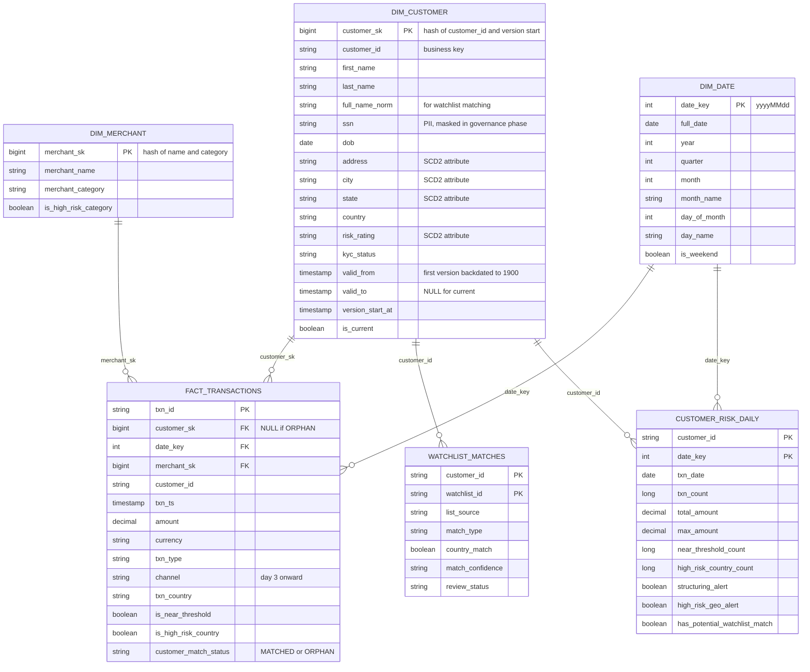

## Gold data model

```mermaid
erDiagram
  DIM_CUSTOMER ||--o{ FACT_TRANSACTIONS : "customer_sk"
  DIM_DATE ||--o{ FACT_TRANSACTIONS : "date_key"
  DIM_MERCHANT ||--o{ FACT_TRANSACTIONS : "merchant_sk"
  DIM_CUSTOMER ||--o{ WATCHLIST_MATCHES : "customer_id"
  DIM_CUSTOMER ||--o{ CUSTOMER_RISK_DAILY : "customer_id"
  DIM_DATE ||--o{ CUSTOMER_RISK_DAILY : "date_key"

  DIM_CUSTOMER {
    bigint customer_sk PK "hash of customer_id and version start"
    string customer_id "business key"
    string first_name
    string last_name
    string full_name_norm "for watchlist matching"
    string ssn "PII, masked in governance phase"
    date dob
    string address "SCD2 attribute"
    string city "SCD2 attribute"
    string state "SCD2 attribute"
    string country
    string risk_rating "SCD2 attribute"
    string kyc_status
    timestamp valid_from "first version backdated to 1900"
    timestamp valid_to "NULL for current"
    timestamp version_start_at
    boolean is_current
  }

  DIM_DATE {
    int date_key PK "yyyyMMdd"
    date full_date
    int year
    int quarter
    int month
    string month_name
    int day_of_month
    string day_name
    boolean is_weekend
  }

  DIM_MERCHANT {
    bigint merchant_sk PK "hash of name and category"
    string merchant_name
    string merchant_category
    boolean is_high_risk_category
  }

  FACT_TRANSACTIONS {
    string txn_id PK
    bigint customer_sk FK "NULL if ORPHAN"
    int date_key FK
    bigint merchant_sk FK
    string customer_id
    timestamp txn_ts
    decimal amount
    string currency
    string txn_type
    string channel "day 3 onward"
    string txn_country
    boolean is_near_threshold
    boolean is_high_risk_country
    string customer_match_status "MATCHED or ORPHAN"
  }

  WATCHLIST_MATCHES {
    string customer_id PK
    string watchlist_id PK
    string list_source
    string match_type
    boolean country_match
    string match_confidence
    string review_status
  }

  CUSTOMER_RISK_DAILY {
    string customer_id PK
    int date_key PK
    date txn_date
    long txn_count
    decimal total_amount
    decimal max_amount
    long near_threshold_count
    long high_risk_country_count
    boolean structuring_alert
    boolean high_risk_geo_alert
    boolean has_potential_watchlist_match
  }
```

Keys are logical (the pipeline does not enforce them). `WATCHLIST_MATCHES.customer_id` and `CUSTOMER_RISK_DAILY.customer_id` reference the business key, not the surrogate key.
